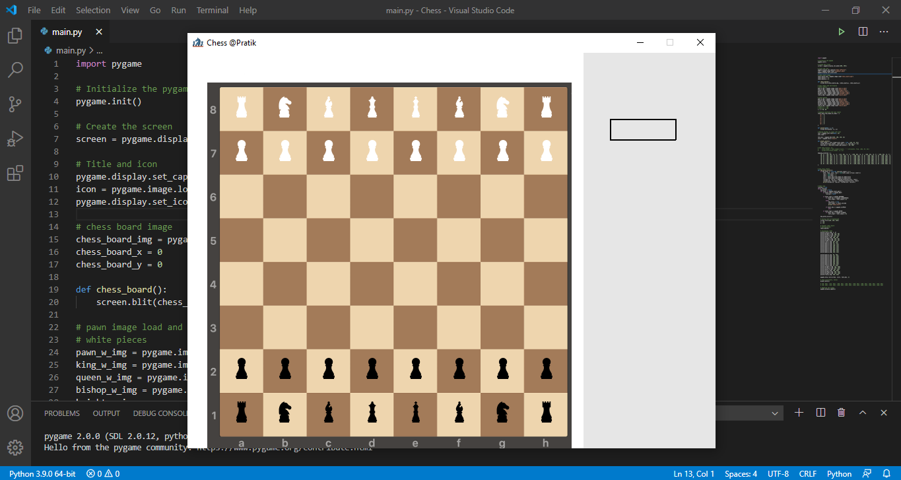
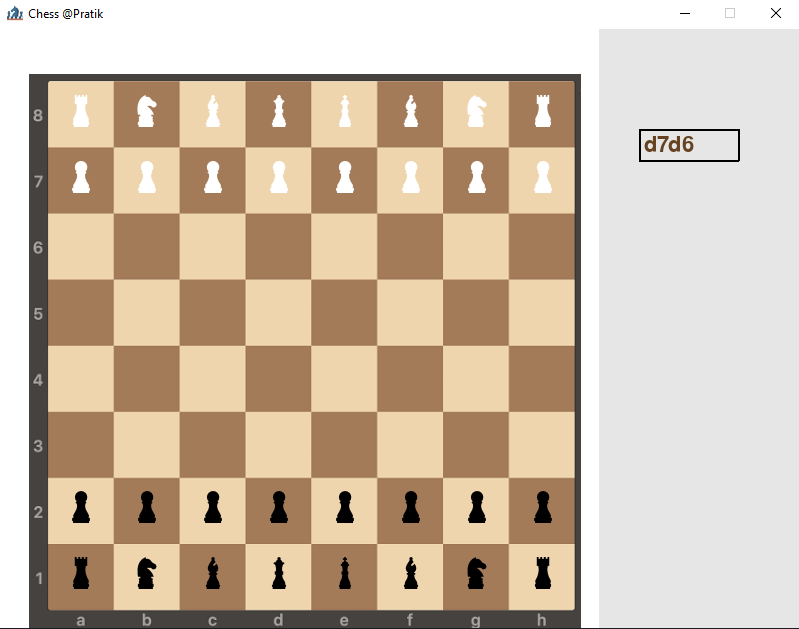

# Chess Project

- Chess is a two-player strategy based game played on a board with 64 cells arranged in an 8×8 square grid.
- The objective of doing this project is to implement the concepts learned until now in python to build a real-life working game from scratch.
- This project is done in python and pygame is used to support this game aesthetically.
- This project is still in development phase.

---

## Requirements

- Python 3.9.0
- Any code editor like VS Code

---

## Approach
- The chess game has an 8x8 grid board with 64 total cells in it.
- Each cell out of 64 cells has specific locations in the form of matrices.
- The moves in chess are generally read in the form of (A1, B2), as the chess board has A to H columns and 1 to 8 rows in it.
- If the user’s input is for example “A1B2” in the text box provided in the game, the program will capture A, 1, B and 2 in four variables and convert them into locations of the cell.
- After getting the locations the program will check for the validity of the move and more and then it will move the pieces.

---

## Running the project

- Download the zip file and extract it in local.
- Open VS Code.
- Drag and drop **main.py** to VS Code window and run by clicking play button on top right corner.

---

## Screenshots

---